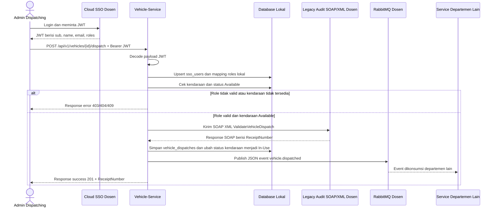

# Analisis Tugas 3 - Vehicle-Service

## Identitas Service

Nama saya Tiara dengan NIM/API Key `102022400230`. Pada proses bisnis Penugasan Perjalanan Dinas atau Dispatching, saya bertanggung jawab pada service **Vehicle-Service** dengan resource utama `vehicles`.

Vehicle-Service digunakan untuk menyimpan dan mengecek data armada kendaraan. Pada Tugas 2, service ini sudah memiliki endpoint REST untuk melihat daftar kendaraan, melihat detail kendaraan, dan menambahkan kendaraan baru. Pada Tugas 3, saya menambahkan capaian integrasi ke layanan pusat berupa SSO, SOAP/XML Legacy Audit, dan RabbitMQ. Layanan pusat dosen yang digunakan mengacu pada PDF "URL dan Akun Tugas IAE", yaitu `https://iae-sso.virtualfri.id`.

## Transaksi Kritis yang Dipilih

Transaksi kritis yang saya pilih adalah **penugasan kendaraan untuk perjalanan dinas**, yaitu proses ketika admin dispatching memilih kendaraan berstatus `Available`, lalu kendaraan tersebut ditugaskan untuk perjalanan dinas dan statusnya berubah menjadi `In-Use`.

Transaksi ini termasuk penting karena bersifat **state-changing**. Sebelum transaksi dilakukan, kendaraan masih tersedia dan dapat dipakai oleh request perjalanan lain. Setelah transaksi berhasil, kendaraan tidak boleh dipilih lagi oleh admin lain karena statusnya sudah berubah menjadi `In-Use`. Jika transaksi ini tidak divalidasi dengan benar, sistem bisa mengalami bentrok penugasan kendaraan, misalnya satu kendaraan dipakai untuk dua perjalanan dinas berbeda.

Karena transaksi ini mengubah status kendaraan, maka saya menghubungkannya dengan sistem audit legacy menggunakan SOAP/XML. Tujuannya agar setiap penugasan kendaraan memiliki bukti audit berupa `ReceiptNumber` dari sistem legacy dosen. Setelah transaksi berhasil, Vehicle-Service juga mengirim event JSON ke RabbitMQ agar departemen lain, seperti penjadwalan driver, administrasi perjalanan, atau monitoring armada, dapat mengetahui bahwa kendaraan sudah ditugaskan.

Endpoint transaksi kritis yang ditambahkan:

```text
POST /api/v1/vehicles/{id}/dispatch
```

Endpoint ini menggunakan Bearer JWT dari SSO. Payload JWT dari Cloud SSO Dosen ditangkap, lalu user dipetakan ke tabel role lokal. Role yang diperbolehkan untuk melakukan dispatch adalah:

```text
fleet_admin
dispatch_admin
```

## Alur Integrasi Teknis

Pada alur Tugas 3, admin dispatching login melalui Cloud SSO Dosen dan mendapatkan JWT. URL SSO dosen adalah `https://iae-sso.virtualfri.id`, dengan endpoint token `/api/v1/auth/token` dan JWKS `/api/v1/auth/jwks` atau `/.well-known/jwks.json`. JWT tersebut dikirim ke Vehicle-Service menggunakan header `Authorization: Bearer <token>`. Vehicle-Service membaca payload JWT, mengambil subject user, nama, email, dan roles, lalu menyimpan atau memperbarui data user pada tabel `sso_users` dan `roles` lokal.

Setelah role valid, Vehicle-Service mengecek apakah kendaraan tersedia. Jika kendaraan tidak ditemukan atau statusnya bukan `Available`, transaksi ditolak. Jika kendaraan tersedia, Vehicle-Service membuat SOAP XML Envelope berisi data transaksi penugasan kendaraan, lalu mengirimkannya ke sistem Legacy Audit Dosen pada endpoint `/soap/v1/audit`. Dari response SOAP, Vehicle-Service menyimpan `ReceiptNumber` sebagai bukti transaksi sudah tervalidasi oleh sistem audit.

Setelah audit berhasil, status kendaraan diubah menjadi `In-Use`, data dispatch disimpan di tabel `vehicle_dispatches`, lalu event bisnis `vehicle.dispatched` dikirim ke RabbitMQ dalam format JSON. Event ini dapat dikonsumsi oleh service lain yang membutuhkan informasi penugasan kendaraan.

## Sequence Diagram Internal



## Modul 1 - Federated SSO

Vehicle-Service menangkap payload JWT melalui middleware `CaptureSsoJwt`. Middleware ini membaca header:

```text
Authorization: Bearer <JWT>
```

Payload JWT diproses oleh `SsoJwtService`. Data yang dipakai adalah `sub`, `name`, `email`, dan `roles`. Data user disimpan pada tabel `sso_users`, sedangkan role disimpan pada tabel `roles`. Relasi user dan role disimpan pada tabel pivot `role_sso_user`.

Endpoint untuk membuktikan payload JWT berhasil ditangkap:

```text
GET /api/v1/sso/profile
```

## Modul 2 - SOAP XML Client

SOAP client dibuat pada file `app/Services/LegacyAuditSoapClient.php`. Service ini mengubah data JSON transaksi dispatch menjadi SOAP XML Envelope dengan struktur kaku sesuai format dari dosen. Tag wajib yang dikirim dalam SOAP Body adalah `TeamID`, `ActivityName`, dan `LogContent`. Untuk Vehicle-Service, `TeamID` diisi `102022400230`, `ActivityName` diisi `VehicleDispatched`, dan `LogContent` berisi CDATA JSON dari transaksi penugasan kendaraan.

Jika `LEGACY_AUDIT_MODE=mock`, sistem akan membuat response SOAP dummy agar alur lokal tetap bisa diuji. Jika ingin diarahkan ke SOAP dosen, mode dapat diganti menjadi `live`, lalu credential SSO diisi melalui `.env` agar service dapat mengambil Bearer token dari SSO dosen sebelum mengirim SOAP.

Receipt dari SOAP disimpan pada field:

```text
legacy_receipt_number
```

## Modul 3 - AMQP Publisher RabbitMQ

Publisher RabbitMQ dibuat pada file `app/Services/BusinessEventPublisher.php` menggunakan package `php-amqplib/php-amqplib`. Setelah transaksi dispatch berhasil, Vehicle-Service membuat event JSON dengan nama:

```text
vehicle.dispatched
```

Event berisi informasi dispatch id, trip reference, data kendaraan, receipt number dari SOAP, dan user SSO yang menyetujui. Pada mode AMQP, event dikirim ke exchange `iae.central.exchange` dengan routing key `vehicle.dispatched`. Pada mode HTTP sesuai PDF dosen, event dikirim ke endpoint `/api/v1/messages/publish` menggunakan Bearer token.

Jika `RABBITMQ_DRIVER=mock` atau `RABBITMQ_ENABLED=false`, publisher berjalan dalam mode mock dan menghasilkan status `mock_published`, sehingga tidak memicu error saat credential RabbitMQ/SSO dosen belum tersedia. Jika ingin mengirim ke pusat dosen, konfigurasi dapat diubah menjadi `RABBITMQ_DRIVER=http` dan `RABBITMQ_ENABLED=true`.

## Modul 4 - Akuntabilitas Progres

Dokumen prompting AI disimpan pada file `PROMPTING_LOG.md`. Dokumen tersebut berisi ringkasan proses prompting dari pembuatan Tugas 2 sampai pengembangan Tugas 3.

## Contoh Request Transaksi Kritis

```bash
curl -X POST http://127.0.0.1:8000/api/v1/vehicles/1/dispatch \
  -H "Content-Type: application/json" \
  -H "Authorization: Bearer <JWT_SSO_DOSEN>" \
  -d "{\"trip_reference\":\"TRIP-T3-001\",\"requester_name\":\"Admin Perjalanan Dinas\",\"destination\":\"Kantor Cabang Bandung\",\"start_date\":\"2026-06-10\",\"end_date\":\"2026-06-11\"}"
```

Response sukses:

```json
{
  "status": "success",
  "message": "Vehicle dispatch transaction completed successfully",
  "data": {
    "trip_reference": "TRIP-T3-001",
    "dispatch_status": "Dispatched",
    "legacy_receipt_number": "MOCK-SOAP-20260605034743-1",
    "published_event_status": "mock_published"
  },
  "meta": {
    "service_name": "Vehicle-Service",
    "api_version": "v1"
  }
}
```
